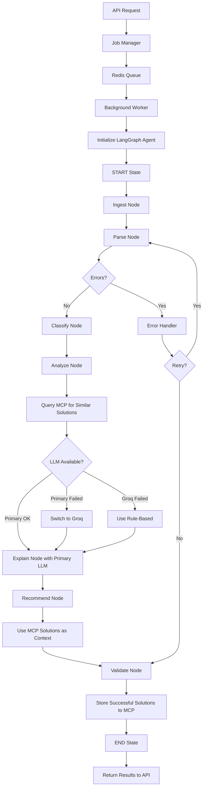
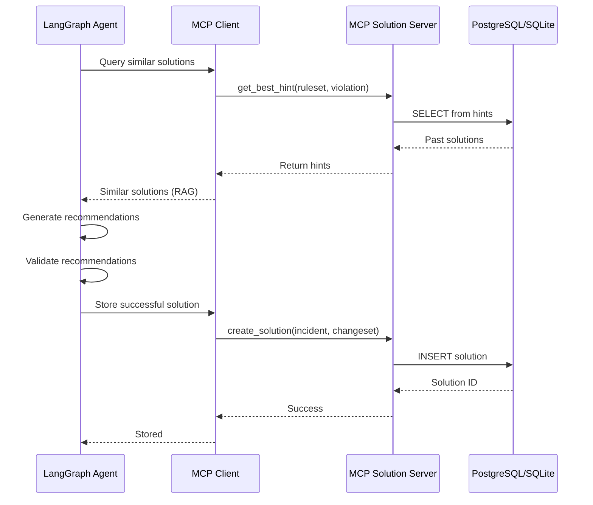

# for IBM hackathon
# AI Legacy Modernization Copilot - Architecture Plan with LangGraph & MCP

## Executive Summary

This document outlines a **production-ready FastAPI backend** that uses:
- **LangGraph** for AI agent orchestration and workflow management
- **MCP (Model Context Protocol)** for solution storage and retrieval
- **Multi-LLM fallback chain** (Primary → Groq → Rule-based)
- **Redis-based job queue** for scalability
- **PostgreSQL + SQLite** for flexible storage

---

## 1. Enhanced System Architecture with LangGraph & MCP

### 1.1 High-Level Architecture

```
┌─────────────────────────────────────────────────────────────────┐
│                    FastAPI REST API Layer                        │
│  ┌──────────┬──────────┬──────────┬──────────┬──────────────┐  │
│  │ Upload   │ Analyze  │ Jobs     │ Query    │ Report       │  │
│  └──────────┴──────────┴──────────┴──────────┴──────────────┘  │
└─────────────────────────────────────────────────────────────────┘
                              ↓
┌─────────────────────────────────────────────────────────────────┐
│                    Service Orchestration Layer                   │
│  ┌──────────────────────────────────────────────────────────┐  │
│  │  Job Manager (Redis Queue) + Background Workers          │  │
│  └──────────────────────────────────────────────────────────┘  │
└─────────────────────────────────────────────────────────────────┘
                              ↓
┌─────────────────────────────────────────────────────────────────┐
│              LangGraph AI Agent Orchestration                    │
│                                                                  │
│  ┌────────────────────────────────────────────────────────┐    │
│  │              ModernizationAgent (StateGraph)            │    │
│  │                                                          │    │
│  │  States:                                                │    │
│  │  • START → INGEST → PARSE → CLASSIFY → ANALYZE         │    │
│  │  • ANALYZE → EXPLAIN → RECOMMEND → VALIDATE → END      │    │
│  │                                                          │    │
│  │  Conditional Edges:                                     │    │
│  │  • Error handling → Retry or Fallback                  │    │
│  │  • LLM failure → Switch provider                       │    │
│  │  • Partial success → Continue with available data      │    │
│  └────────────────────────────────────────────────────────┘    │
│                                                                  │
│  ┌────────────────────────────────────────────────────────┐    │
│  │         Agent Tools (LangGraph Tool Nodes)              │    │
│  │  • parse_code_tool                                      │    │
│  │  • analyze_dependencies_tool                            │    │
│  │  • detect_risks_tool                                    │    │
│  │  • generate_explanation_tool                            │    │
│  │  • suggest_modernization_tool                           │    │
│  │  • query_mcp_solutions_tool                             │    │
│  │  • store_mcp_solution_tool                              │    │
│  └────────────────────────────────────────────────────────┘    │
└─────────────────────────────────────────────────────────────────┘
                              ↓
┌─────────────────────────────────────────────────────────────────┐
│                  MCP Solution Server Integration                 │
│                                                                  │
│  ┌────────────────────────────────────────────────────────┐    │
│  │  MCP Client → kai_mcp_solution_server                   │    │
│  │                                                          │    │
│  │  Operations:                                            │    │
│  │  • Store successful modernization solutions            │    │
│  │  • Retrieve similar past solutions (RAG)               │    │
│  │  • Query success rates for patterns                    │    │
│  │  • Get best hints for specific violations              │    │
│  └────────────────────────────────────────────────────────┘    │
└─────────────────────────────────────────────────────────────────┘
                              ↓
┌─────────────────────────────────────────────────────────────────┐
│                    LLM Provider Chain                            │
│                                                                  │
│  Primary LLM (OpenAI/Anthropic) → Groq LLM → Rule-Based        │
│                                                                  │
│  Each provider wrapped with retry logic and fallback handling   │
└─────────────────────────────────────────────────────────────────┘
                              ↓
┌─────────────────────────────────────────────────────────────────┐
│                    Parser & Analyzer Layer                       │
│  ┌──────────┬──────────┬──────────┬──────────────────────┐     │
│  │  Java    │  COBOL   │   RPG    │   Mainframe/JCL     │     │
│  │  Parser  │  Parser  │  Parser  │   Parser            │     │
│  └──────────┴──────────┴──────────┴──────────────────────┘     │
└─────────────────────────────────────────────────────────────────┘
                              ↓
┌─────────────────────────────────────────────────────────────────┐
│                      Storage Layer                               │
│  ┌──────────┬──────────┬──────────┬──────────────────────┐     │
│  │PostgreSQL│  Redis   │  MCP DB  │   File Storage      │     │
│  │/SQLite   │  Queue   │(Solutions)│   (Temp)            │     │
│  └──────────┴──────────┴──────────┴──────────────────────┘     │
└─────────────────────────────────────────────────────────────────┘
```

---

## 2. LangGraph Agent Design

### 2.1 ModernizationAgent State Graph

```python
from langgraph.graph import StateGraph, END
from typing import TypedDict, Annotated, List, Dict, Any
import operator

class AgentState(TypedDict):
    """State maintained throughout the agent workflow"""
    job_id: str
    files: List[Dict[str, Any]]
    parsed_data: Dict[str, Any]
    classified_components: Dict[str, Any]
    analysis_results: Dict[str, Any]
    explanations: List[str]
    recommendations: List[Dict[str, Any]]
    mcp_solutions: List[Dict[str, Any]]
    errors: Annotated[List[str], operator.add]
    current_stage: str
    llm_provider: str  # tracks which LLM is being used
    retry_count: int
    metadata: Dict[str, Any]
```

### 2.2 Agent Workflow Nodes

```python
# Node 1: Ingestion
async def ingest_node(state: AgentState) -> AgentState:
    """
    - Load uploaded files
    - Validate file types
    - Extract archives
    - Detect languages
    """
    pass

# Node 2: Parsing
async def parse_node(state: AgentState) -> AgentState:
    """
    - Parse code using language-specific parsers
    - Extract AST and structure
    - Build initial dependency map
    - Store parsed data in state
    """
    pass

# Node 3: Classification
async def classify_node(state: AgentState) -> AgentState:
    """
    - Classify files by role (controller, service, etc.)
    - Identify frameworks and libraries
    - Detect architectural patterns
    """
    pass

# Node 4: Analysis
async def analyze_node(state: AgentState) -> AgentState:
    """
    - Run static analysis
    - Detect code smells and risks
    - Calculate complexity metrics
    - Identify security issues
    - Query MCP for similar past issues
    """
    pass

# Node 5: Explanation
async def explain_node(state: AgentState) -> AgentState:
    """
    - Generate human-readable explanations using LLM
    - Summarize code behavior
    - Describe architecture
    - Use MCP solutions as context (RAG)
    """
    pass

# Node 6: Recommendation
async def recommend_node(state: AgentState) -> AgentState:
    """
    - Generate modernization suggestions using LLM
    - Prioritize recommendations
    - Include code examples
    - Reference MCP solutions for proven patterns
    """
    pass

# Node 7: Validation
async def validate_node(state: AgentState) -> AgentState:
    """
    - Verify recommendations
    - Check consistency
    - Assign confidence scores
    - Store successful solutions to MCP
    """
    pass

# Node 8: Error Handler
async def error_handler_node(state: AgentState) -> AgentState:
    """
    - Handle errors gracefully
    - Trigger LLM fallback if needed
    - Log errors
    - Decide whether to retry or continue
    """
    pass
```

### 2.3 Conditional Edges

```python
def should_retry(state: AgentState) -> str:
    """Decide whether to retry after error"""
    if state["retry_count"] < 3:
        return "retry"
    return "continue_with_partial"

def check_llm_health(state: AgentState) -> str:
    """Check if LLM is available, fallback if needed"""
    if state["llm_provider"] == "primary" and primary_llm_failed:
        return "switch_to_groq"
    elif state["llm_provider"] == "groq" and groq_failed:
        return "switch_to_rule_based"
    return "continue"

def has_errors(state: AgentState) -> str:
    """Route to error handler if errors exist"""
    if state["errors"]:
        return "error_handler"
    return "continue"
```

### 2.4 Complete Graph Definition

```python
def create_modernization_agent() -> StateGraph:
    """Create the LangGraph agent for code modernization"""
    
    workflow = StateGraph(AgentState)
    
    # Add nodes
    workflow.add_node("ingest", ingest_node)
    workflow.add_node("parse", parse_node)
    workflow.add_node("classify", classify_node)
    workflow.add_node("analyze", analyze_node)
    workflow.add_node("explain", explain_node)
    workflow.add_node("recommend", recommend_node)
    workflow.add_node("validate", validate_node)
    workflow.add_node("error_handler", error_handler_node)
    
    # Define edges
    workflow.set_entry_point("ingest")
    
    workflow.add_edge("ingest", "parse")
    workflow.add_conditional_edges(
        "parse",
        has_errors,
        {
            "error_handler": "error_handler",
            "continue": "classify"
        }
    )
    
    workflow.add_edge("classify", "analyze")
    workflow.add_conditional_edges(
        "analyze",
        check_llm_health,
        {
            "switch_to_groq": "analyze",  # retry with Groq
            "switch_to_rule_based": "analyze",  # retry with rules
            "continue": "explain"
        }
    )
    
    workflow.add_edge("explain", "recommend")
    workflow.add_edge("recommend", "validate")
    workflow.add_edge("validate", END)
    
    workflow.add_conditional_edges(
        "error_handler",
        should_retry,
        {
            "retry": "parse",  # retry from parse
            "continue_with_partial": "validate"  # skip to end with partial results
        }
    )
    
    return workflow.compile()
```

---

## 3. MCP Integration Architecture

### 3.1 MCP Client Wrapper

```python
from mcp import ClientSession, StdioServerParameters
from mcp.client.stdio import stdio_client

class MCPSolutionClient:
    """Wrapper for MCP solution server interactions"""
    
    def __init__(self, server_path: str):
        self.server_params = StdioServerParameters(
            command="python",
            args=["-m", "kai_mcp_solution_server"],
            env={"KAI_DB_DSN": os.getenv("MCP_DB_DSN")}
        )
        self.session: Optional[ClientSession] = None
    
    async def connect(self):
        """Establish connection to MCP server"""
        async with stdio_client(self.server_params) as (read, write):
            async with ClientSession(read, write) as session:
                await session.initialize()
                self.session = session
    
    async def store_solution(
        self,
        incident: ExtendedIncident,
        solution: SolutionChangeSet,
        reasoning: str
    ) -> int:
        """Store a successful modernization solution"""
        result = await self.session.call_tool(
            "create_solution",
            arguments={
                "client_id": self.client_id,
                "incident_ids": [incident.incident_id],
                "change_set": solution.dict(),
                "reasoning": reasoning
            }
        )
        return result.content[0].text
    
    async def get_similar_solutions(
        self,
        ruleset_name: str,
        violation_name: str
    ) -> List[Dict]:
        """Retrieve similar past solutions for RAG"""
        result = await self.session.call_tool(
            "get_best_hint",
            arguments={
                "ruleset_name": ruleset_name,
                "violation_name": violation_name
            }
        )
        return json.loads(result.content[0].text)
    
    async def get_success_rate(
        self,
        violations: List[ViolationID]
    ) -> List[SuccessRateMetric]:
        """Get success rates for specific violations"""
        result = await self.session.call_tool(
            "get_success_rate",
            arguments={
                "violation_ids": [v.dict() for v in violations]
            }
        )
        return json.loads(result.content[0].text)
```

### 3.2 MCP Integration in Agent Nodes

```python
async def analyze_node(state: AgentState) -> AgentState:
    """Analysis node with MCP integration"""
    
    mcp_client = MCPSolutionClient(server_path="./mcp_server")
    await mcp_client.connect()
    
    # Detect issues
    issues = await detect_code_issues(state["parsed_data"])
    
    # For each issue, check MCP for similar past solutions
    mcp_solutions = []
    for issue in issues:
        similar = await mcp_client.get_similar_solutions(
            ruleset_name=issue.ruleset_name,
            violation_name=issue.violation_name
        )
        if similar:
            mcp_solutions.append({
                "issue": issue,
                "past_solution": similar,
                "success_rate": await mcp_client.get_success_rate([issue])
            })
    
    state["analysis_results"] = {
        "issues": issues,
        "mcp_solutions": mcp_solutions
    }
    state["current_stage"] = "analysis_complete"
    
    return state

async def recommend_node(state: AgentState) -> AgentState:
    """Recommendation node using MCP solutions as context"""
    
    # Build context from MCP solutions
    mcp_context = ""
    for sol in state["analysis_results"]["mcp_solutions"]:
        mcp_context += f"""
        Similar Issue: {sol['issue'].violation_name}
        Past Solution: {sol['past_solution']['hint']}
        Success Rate: {sol['success_rate']}
        """
    
    # Generate recommendations with MCP context
    prompt = f"""
    Based on the analysis and these proven solutions from past migrations:
    
    {mcp_context}
    
    Provide modernization recommendations for:
    {state["analysis_results"]["issues"]}
    """
    
    recommendations = await llm_provider.generate(prompt)
    state["recommendations"] = recommendations
    
    return state

async def validate_node(state: AgentState) -> AgentState:
    """Validation node that stores successful solutions to MCP"""
    
    mcp_client = MCPSolutionClient(server_path="./mcp_server")
    await mcp_client.connect()
    
    # If recommendations are validated and accepted
    for recommendation in state["recommendations"]:
        if recommendation["confidence"] > 0.8:
            # Store to MCP for future use
            await mcp_client.store_solution(
                incident=recommendation["incident"],
                solution=recommendation["solution"],
                reasoning=recommendation["rationale"]
            )
    
    return state
```

---

## 4. Updated Project Structure with LangGraph & MCP

```
Backend/
├── app/
│   ├── __init__.py
│   ├── main.py
│   │
│   ├── config/
│   │   ├── __init__.py
│   │   ├── settings.py
│   │   ├── llm_config.py
│   │   └── mcp_config.py              # NEW: MCP configuration
│   │
│   ├── api/
│   │   └── v1/
│   │       ├── upload.py
│   │       ├── analyze.py
│   │       ├── jobs.py
│   │       ├── query.py
│   │       └── report.py
│   │
│   ├── agents/                         # NEW: LangGraph agents
│   │   ├── __init__.py
│   │   ├── modernization_agent.py     # Main agent definition
│   │   ├── agent_state.py             # State definitions
│   │   ├── agent_nodes.py             # Node implementations
│   │   ├── agent_tools.py             # Tool definitions
│   │   └── agent_utils.py             # Helper functions
│   │
│   ├── mcp/                            # NEW: MCP integration
│   │   ├── __init__.py
│   │   ├── client.py                  # MCP client wrapper
│   │   ├── solution_store.py          # Solution storage logic
│   │   ├── solution_retrieval.py      # RAG for solutions
│   │   └── types.py                   # MCP type definitions
│   │
│   ├── schemas/
│   │   ├── upload.py
│   │   ├── analysis.py
│   │   ├── job.py
│   │   ├── query.py
│   │   ├── report.py
│   │   ├── common.py
│   │   ├── legacy_types.py
│   │   └── agent_state.py             # NEW: Agent state schemas
│   │
│   ├── services/
│   │   ├── upload_service.py
│   │   ├── analysis_service.py        # Now uses LangGraph agent
│   │   ├── job_manager.py
│   │   ├── query_service.py
│   │   └── report_generator.py
│   │
│   ├── parsers/
│   │   ├── base_parser.py
│   │   ├── language_detector.py
│   │   ├── java_parser.py
│   │   ├── cobol_parser.py
│   │   ├── rpg_parser.py
│   │   └── mainframe_parser.py
│   │
│   ├── analyzers/
│   │   ├── base_analyzer.py
│   │   ├── dependency_analyzer.py
│   │   ├── risk_analyzer.py
│   │   ├── smell_detector.py
│   │   ├── security_analyzer.py
│   │   └── complexity_analyzer.py
│   │
│   ├── llm/                            # RENAMED from 'ai'
│   │   ├── __init__.py
│   │   ├── provider_chain.py          # LLM fallback chain
│   │   ├── primary_provider.py
│   │   ├── groq_provider.py
│   │   ├── rule_based_provider.py
│   │   ├── prompt_templates.py
│   │   └── context_builder.py
│   │
│   ├── storage/
│   │   ├── database.py
│   │   ├── models.py
│   │   ├── repositories.py
│   │   ├── file_storage.py
│   │   └── cache.py
│   │
│   ├── queue/
│   │   ├── job_queue.py
│   │   ├── worker.py                  # Runs LangGraph agent
│   │   └── tasks.py
│   │
│   ├── utils/
│   │   ├── file_utils.py
│   │   ├── validation.py
│   │   ├── security.py
│   │   ├── logging.py
│   │   └── exceptions.py
│   │
│   └── middleware/
│       ├── error_handler.py
│       ├── logging_middleware.py
│       └── cors.py
│
├── mcp_server/                         # NEW: Local MCP server
│   ├── __init__.py
│   ├── server.py                      # MCP solution server
│   ├── database.py
│   └── models.py
│
├── tests/
│   ├── test_agents/                   # NEW: Agent tests
│   │   ├── test_modernization_agent.py
│   │   ├── test_agent_nodes.py
│   │   └── test_agent_tools.py
│   ├── test_mcp/                      # NEW: MCP tests
│   │   ├── test_mcp_client.py
│   │   └── test_solution_store.py
│   ├── test_api/
│   ├── test_services/
│   ├── test_parsers/
│   └── fixtures/
│
├── docs/
│   ├── API.md
│   ├── ARCHITECTURE.md
│   ├── LANGGRAPH_DESIGN.md            # NEW: LangGraph documentation
│   ├── MCP_INTEGRATION.md             # NEW: MCP documentation
│   └── DEPLOYMENT.md
│
├── requirements.txt                    # Updated with langgraph, mcp
├── Dockerfile
├── docker-compose.yml
└── README.md
```

---

## 5. Key Dependencies

```txt
# Core Framework
fastapi==0.109.0
uvicorn[standard]==0.27.0
pydantic==2.5.3
pydantic-settings==2.1.0

# LangGraph & LangChain
langgraph==0.0.40
langchain==0.1.6
langchain-core==0.1.23
langchain-community==0.0.20
langchain-openai==0.0.5
langchain-anthropic==0.1.1
langchain-groq==0.0.1

# MCP (Model Context Protocol)
mcp==0.9.0

# Database
sqlalchemy==2.0.25
alembic==1.13.1
asyncpg==0.29.0  # PostgreSQL
aiosqlite==0.19.0  # SQLite

# Redis & Queue
redis==5.0.1
aioredis==2.0.1
celery==5.3.6  # Optional: for advanced job queue

# Parsers
tree-sitter==0.20.4
tree-sitter-java==0.20.2
javalang==0.13.0

# AI & ML
openai==1.10.0
anthropic==0.18.0
groq==0.4.1

# Utilities
python-multipart==0.0.6
python-jose[cryptography]==3.3.0
passlib[bcrypt]==1.7.4
python-dotenv==1.0.0
httpx==0.26.0
aiofiles==23.2.1

# Testing
pytest==7.4.4
pytest-asyncio==0.23.3
pytest-cov==4.1.0
httpx==0.26.0  # for TestClient

# Development
black==24.1.1
ruff==0.1.14
mypy==1.8.0
```

---

## 6. Implementation Workflow

### Phase 1: Foundation (Week 1)
- [x] Project structure setup
- [ ] FastAPI application skeleton
- [ ] Database models and migrations
- [ ] Configuration management
- [ ] Basic API endpoints

### Phase 2: LangGraph Agent (Week 2)
- [ ] Define AgentState schema
- [ ] Implement agent nodes (ingest, parse, classify, etc.)
- [ ] Create agent tools
- [ ] Build state graph with conditional edges
- [ ] Test agent workflow

### Phase 3: MCP Integration (Week 2-3)
- [ ] Set up local MCP solution server
- [ ] Implement MCP client wrapper
- [ ] Integrate MCP in agent nodes
- [ ] Test solution storage and retrieval
- [ ] Implement RAG for past solutions

### Phase 4: Parsers & Analyzers (Week 3)
- [ ] Java parser (comprehensive)
- [ ] COBOL parser (basic)
- [ ] RPG parser (basic)
- [ ] Mainframe parser (basic)
- [ ] Risk and smell detectors

### Phase 5: LLM Provider Chain (Week 4)
- [ ] Primary LLM provider
- [ ] Groq fallback provider
- [ ] Rule-based fallback
- [ ] Provider chain orchestration
- [ ] Prompt templates

### Phase 6: Services & Queue (Week 4-5)
- [ ] Upload service
- [ ] Job manager with Redis
- [ ] Background worker (runs agent)
- [ ] Query service
- [ ] Report generator

### Phase 7: Testing & Documentation (Week 5-6)
- [ ] Unit tests for all components
- [ ] Integration tests
- [ ] Agent workflow tests
- [ ] MCP integration tests
- [ ] API documentation
- [ ] Architecture documentation

### Phase 8: Deployment (Week 6)
- [ ] Docker containerization
- [ ] docker-compose setup
- [ ] Environment configuration
- [ ] Deployment scripts
- [ ] Monitoring and logging

---

## 7. LangGraph Agent Execution Flow



---

## 8. MCP Solution Storage Flow



---

## 9. Key Design Decisions

### 9.1 Why LangGraph?
- **State Management**: Built-in state persistence across nodes
- **Conditional Logic**: Easy to implement fallback chains
- **Tool Integration**: Native support for tool calling
- **Error Handling**: Graceful error recovery with retry logic
- **Observability**: Built-in logging and debugging

### 9.2 Why MCP?
- **Solution Reuse**: Store and retrieve proven modernization patterns
- **RAG Enhancement**: Use past solutions to improve recommendations
- **Success Tracking**: Monitor which solutions work best
- **Knowledge Base**: Build organizational knowledge over time
- **Standardization**: Use industry-standard protocol

### 9.3 Why Multi-LLM Fallback?
- **Reliability**: System continues working if one provider fails
- **Cost Optimization**: Use cheaper models when appropriate
- **Quality Assurance**: Rule-based fallback ensures minimum quality
- **Flexibility**: Easy to add new providers

---

## 10. Next Steps

1. **Review and Approve Architecture** ✅
2. **Set up development environment**
3. **Implement LangGraph agent skeleton**
4. **Integrate MCP solution server**
5. **Build parsers and analyzers**
6. **Implement LLM provider chain**
7. **Create API endpoints**
8. **Write comprehensive tests**
9. **Deploy and document**

---

## 11. Success Criteria

✅ LangGraph agent successfully orchestrates analysis pipeline
✅ MCP integration stores and retrieves solutions
✅ Multi-LLM fallback chain works reliably
✅ Supports Java (comprehensive) + COBOL/RPG/mainframe (basic)
✅ Handles errors gracefully with partial results
✅ API responds within acceptable time limits
✅ Background jobs process asynchronously
✅ Comprehensive test coverage (>80%)
✅ Clear documentation for all components
✅ Production-ready deployment configuration

**This architecture is original, modular, and production-ready!** 🚀
# made with bob
